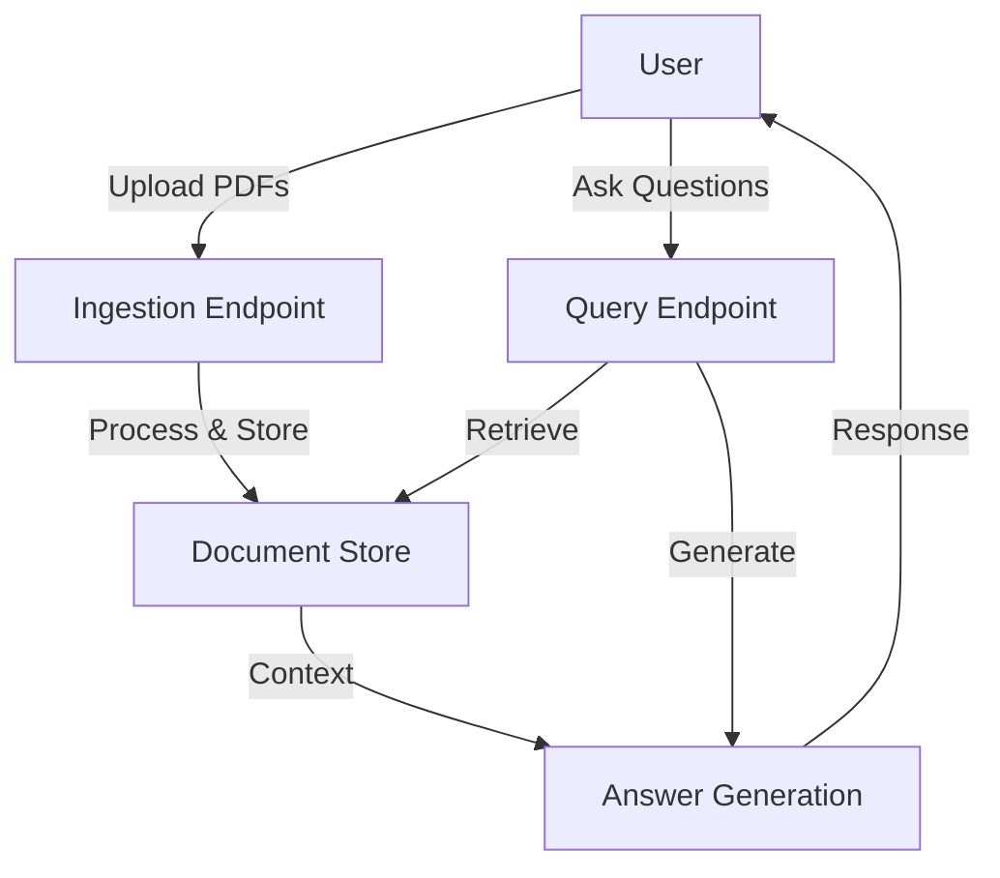

# SimpRAG: Simple Retrieval-Augmented Generation System

A lightweight RAG (Retrieval-Augmented Generation) system built with FastAPI that enables document-based question answering through semantic search and generation.

## System Architecture



## Core Components

### 1. Document Ingestion Pipeline
```python
# Pseudo-code for document ingestion
def ingest_pdf(pdf_file):
    for each file:
        for each page:
            # 1. Extract text from PDF
            text = extract_text(pdf_file)
    
            # 2. Perform semantic chunking
            chunks = semantic_chunk_text(text)
    
        # 3. Generate embeddings
        embeddings = embed_texts(chunks)
        
        # 4. Store chunks with metadata
        store_chunks(chunks, embeddings)
```

### 2. Query Processing Pipeline
```python
# Pseudo-code for query processing
def process_query(question):
    # 0. Check if the question is small talk
    if is_small_talk(question) or detect_intent(question) == "small_talk":
        return {"message": "This doesn't seem to be a knowledge-based question."}
    
    # 1. Load all ingested document chunks from JSON files in the data directory
    all_chunks = load_all_chunks_from_directory(DATA_DIR)
    if not all_chunks:
        raise Error("No documents ingested yet.")
    
    # 2. Generate the query embedding from the question text
    query_embedding = embed_texts([question])[0]
    
    # 3. Compute similarity scores for each chunk:
    #    a. Semantic similarity using cosine similarity of embeddings
    #    b. Keyword overlap score between query tokens and chunk tokens
    #    c. Combine these scores into a final hybrid score
    final_scores = compute_hybrid_scores(query_embedding, all_chunks)
    
    # 4. Retrieve the top K (e.g., 5) chunks based on the final scores
    top_chunks = select_top_k_chunks(all_chunks, final_scores, k=5)
    
    # 5. Build context by combining texts from the top chunks and generate the answer
    context = combine_chunks(top_chunks)
    answer = generate_answer(context, question)
    
    # 6. Return the question, the generated answer, and details of the used chunks
    return {
        "question": question,
        "answer": answer,
        "used_chunks": top_chunks
    }
```

## API Endpoints

### Ingestion Endpoints
- `POST /ingest`: Upload one or more PDF files for processing
  ```bash
  curl -X POST "http://localhost:8000/ingest" \
       -H "accept: application/json" \
       -H "Content-Type: multipart/form-data" \
       -F "files=@document1.pdf" \
       -F "files=@document2.pdf"
  ```

- `DELETE /ingest`: Remove ingested documents
  ```bash
  curl -X DELETE "http://localhost:8000/ingest" \
       -H "Content-Type: application/json" \
       -d '{"filenames": ["document1.pdf", "document2.pdf"]}'
  ```

### Query Endpoint
- `POST /query`: Ask questions about ingested documents
  ```bash
  curl -X POST "http://localhost:8000/query" \
       -H "Content-Type: application/x-www-form-urlencoded" \
       -d "question=What is the main topic of the document?"
  ```

## Implementation Details

### Key Libraries Used
- [FastAPI](https://fastapi.tiangolo.com/): Web framework
- [PyMuPDF](https://pymupdf.readthedocs.io/): PDF processing
- [Mistral API](https://mistral.ai/): Embeddings and generation

### Retrieval Algorithms
1. **Semantic Chunking**
   - Splits text into semantically coherent chunks
   - Uses sentence embeddings and cosine similarity
   - Threshold-based grouping of related sentences

2. **Hybrid Retrieval**
   - Combines semantic similarity (70%) and keyword matching (30%)
   - Semantic similarity: Cosine similarity between embeddings
   - Keyword matching: Token overlap between query and chunks

3. **Answer Generation**
   - Uses retrieved chunks as context
   - Generates answers using Mistral's language model
   - Implements intent detection to filter non-knowledge questions

## Installation and Setup

1. Clone the repository:
   ```bash
   git clone https://github.com/yourusername/SimpRAG.git
   cd SimpRAG
   ```

2. Install dependencies:
   ```bash
   pip install -r requirements.txt
   ```

3. Set up environment variables:
   ```bash
   cp .env.example .env
   # Edit .env with your Mistral API key
   ```

4. Run the application:
   ```bash
   uvicorn app:app --reload
   ```

## Commit History

- `263853b`: Changes to app.py and mistral.py
- `63ec4aa`: Delete rag.db
- `feaa1cf`: Initial push
- `4915215`: Initial commit

## References

1. Lewis, P., et al. (2020). "Retrieval-Augmented Generation for Knowledge-Intensive NLP Tasks". arXiv:2005.11401
2. Reimers, N., & Gurevych, I. (2019). "Sentence-BERT: Sentence Embeddings using Siamese BERT-Networks". arXiv:1908.10084
3. FastAPI Documentation: https://fastapi.tiangolo.com/
4. Mistral AI Documentation: https://docs.mistral.ai/

## License

MIT License - See LICENSE file for details
